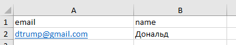
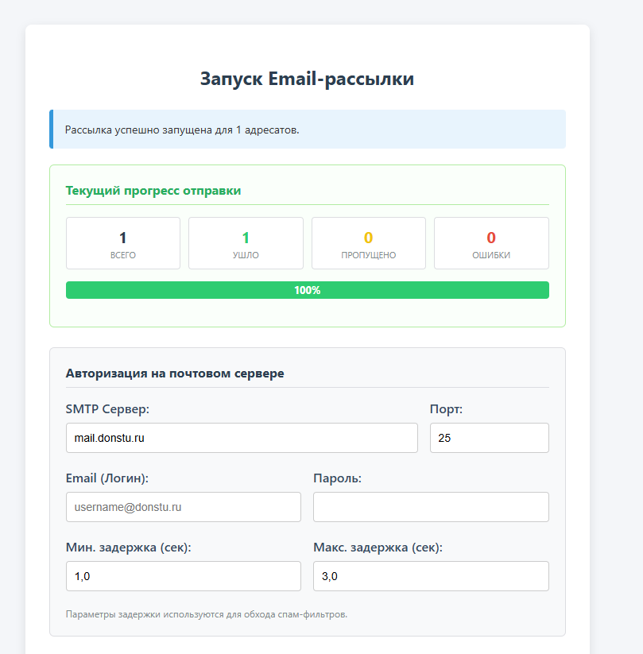

# DSTU Multi-Mail service

## История создания
На работе возникла реальная задача: требовалось регулярно делать массовые информационные рассылки по базе адресатов (студенты, сотрудники, партнеры). Существующие готовые решения либо были платными, либо имели перегруженный интерфейс для обычного пользователя.
Вместо использования сторонних сервисов, для практики, я принял решение разработать свою утилиту с удобным веб-интерфейсом.

## Стек технологий

* **Backend:** Python 3.10+, FastAPI, Uvicorn, openpyxl, aiosmtplib.
* **Frontend:** HTML5, CSS3, JavaScript (Vanilla AJAX / Polling).
* **Шаблонизатор:** Jinja2.

---

## Как запустить локально (Для разработки)

1. Клонируйте репозиторий:
   ```bash
   git clone git@github.com:Pashec/dstu-multimail-service.git
   ```
2. Создайте и активируйте виртуальное окружение:
    ```bash
    python -m venv .venv
    # Для Windows:
    source venv/Scripts/activate
    # Для Linux/MacOS:
    source .venv/bin/activate
    ```
3. Установите зависимости:
    ```bash
    pip install -r requirements.txt
    ```
4. Запустите приложение:
    ```bash
    python main.py
    ```

После запуска программа автоматически откроет вкладку в браузере по адресу http://127.0.0.1:8000.

## Сборка в самостоятельный .exe файл

1. ```bash
    pip install pyinstaller
    ```

2. ```bash
    pyinstaller --noconfirm --onedir --windowed --add-data "templates;templates" main.py
    ```

Папка со сборкой появится в директории dist/

## Требования к файлу Excel

Для корректной работы парсера первая строка вашей таблицы обязательно должна содержать заголовки. Наличие колонки с именем email (в нижнем регистре) строго обязательно. Все остальные колонки (например, имя, компания) можно использовать как переменные в тексте письма в формате {имя}.


## Общий вид сервиса

